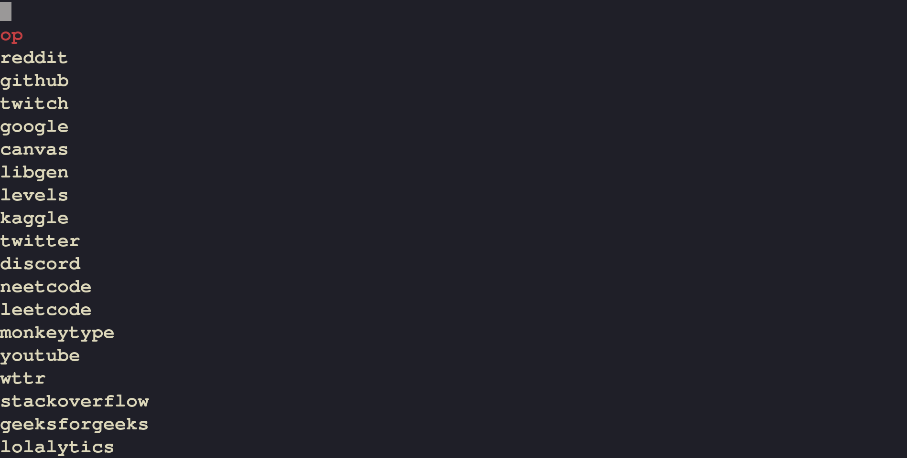

### Website Preview

My first web development project made with svelte to serve as a simple startpage with easy access to bookmarks. The theme is inspired by UNIX/Suckless' d-menu

Deployed using .nojekyll thanks to this [repo](https://github.com/metonym/sveltekit-gh-pages).
